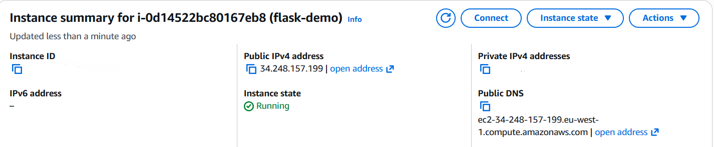

# Terraform Demo

A containerised Flask notes application deployed to AWS EC2 using Terraform, Docker, and GitHub Actions.

## Tech Stack

- AWS EC2
- Terraform
- Docker
- Flask
- GitHub Actions
- SQLite

## Screenshots

### Application

### AWS EC2

### GitHub Actions

